# CodeCore — Enterprise Architecture Audit

**Repositorio:** `codecore-specifications`  
**Fecha de auditoría:** 19 de mayo de 2026  
**Alcance:** 14 módulos (`module-blueprints/`), especificaciones transversales (`01`–`17`)  
**Metodología:** Revisión como Principal Enterprise Architect (DDD, Hexagonal, EDA, Multi-tenant SaaS, CQRS, Reactive, EIP, Security, Observability)

---

## 1. Propósito de este documento

Este informe consolida la **auditoría arquitectónica profunda** solicitada sobre la documentación de CodeCore. No reescribe la arquitectura ni simplifica conceptos enterprise: **audita**, detecta inconsistencias, señala riesgos y propone mejoras concretas.

**Criterios evaluados:**

1. Bounded contexts incorrectos  
2. Ownership incorrecto  
3. Responsabilidades duplicadas  
4. Aggregates demasiado grandes  
5. Violaciones de DDD  
6. Violaciones de Hexagonal Architecture  
7. Dependencias peligrosas  
8. Acoplamiento excesivo  
9. Eventos mal ubicados  
10. APIs en módulos incorrectos  
11. Violaciones multi-tenant  
12. Riesgos de seguridad  
13. Riesgos de consistencia eventual  
14. Riesgos de escalabilidad  
15. Inconsistencias de nomenclatura  
16. Problemas de event-driven architecture  
17. Violaciones reactive-first  
18. Riesgos de provider lock-in  
19. Problemas de ownership entre módulos  
20. Problemas de separación de dominio  

---

## 2. Contexto de la plataforma

CodeCore **no es un CRUD tradicional**. Es una plataforma enterprise multi-tenant orientada a servir como **core foundation** para múltiples productos SaaS.

La arquitectura documentada sigue:

- Domain-Driven Design  
- Hexagonal Architecture  
- Event-Driven Architecture  
- Reactive Architecture  
- Provider-Agnostic Architecture  
- Multi-Tenant SaaS Architecture  
- Enterprise Security  
- Observability-First Design  

---

## 3. Resumen ejecutivo

| Área | Estado |
|------|--------|
| Visión enterprise (DDD, hexagonal, EDA, reactive, multi-tenant) | Coherente en documentos fundacionales |
| Módulos 01–03 (IAM, Tenant, User) | Modelo DDD explícito, límites relativamente claros |
| Módulos 04–14 | Útiles pero con **otro estilo**; menos rigor en definición de bounded context |
| Seguridad (authN / authZ) | **CRITICAL** — dos contextos compitiendo (IAM vs Authentication Management) |
| Módulo 07 | **CRITICAL** — carpeta `notification-management` con contenido incorrecto y duplicado |
| Stack comercial (09–11) | Buena separación billing / payment; fricción en reconciliation y refunds |
| Config / Tenant / Subscription | **HIGH** — triple ownership de flags, quotas y límites |
| Observability vs Audit | **MEDIUM–HIGH** — solapamiento de telemetría de compliance |
| Módulos referenciados sin blueprint | Notification, Workflow, Scheduling, Forms, Clinical |

### Conclusión principal

La documentación refleja una **ambición arquitectónica enterprise coherente** y reglas transversales maduras. El riesgo principal no es la ausencia de DDD, sino la **inconsistencia evolutiva**: conviven dos generaciones de módulos y **dos definiciones completas de autenticación**, además del **colapso documental del módulo 07**.

Hasta resolver los hallazgos **CRITICAL** (AUD-001, AUD-002, AUD-003), cualquier implementación o generación asistida por IA tenderá a **duplicar servicios, eventos y datos de seguridad** — el fallo más costoso en una plataforma SaaS multi-tenant.

---

## 4. Inventario revisado

### 4.1 Especificaciones transversales

| Documento | Tema |
|-----------|------|
| `01-aggregate-design-rules.md` | Reglas de aggregates |
| `02-entity-standards.md` | Estándares de entidades |
| `03-value-object-standards.md` | Value objects |
| `04-repository-rules.md` | Repositorios |
| `05-service-taxonomy.md` | Taxonomía de servicios |
| `06-reactive-architecture-rules.md` | Arquitectura reactiva |
| `07-transaction-boundaries.md` | Límites transaccionales |
| `08-concurrency-rules.md` | Concurrencia |
| `09-event-engineering-standards.md` | Ingeniería de eventos |
| `10-multitenancy-enforcement-rules.md` | Multi-tenancy |
| `11-security-context-propagation.md` | Propagación de contexto de seguridad |
| `12-auditing-standards.md` | Estándares de auditoría |
| `13-observability-standards.md` | Estándares de observabilidad |
| `16-testing-engineering-standards.md` | Testing |
| `17-ai-development-rules.md` | Reglas para desarrollo con IA |

### 4.2 Module blueprints (14 carpetas)

| # | Carpeta | Estado documental observado |
|---|---------|----------------------------|
| 01 | `identity-access-management` | Blueprint DDD completo, canónico para auth |
| 02 | `tenant-management` | Blueprint DDD completo |
| 03 | `user-management` | Blueprint DDD completo |
| 04 | `authorization-management` | Estilo alternativo, contenido útil |
| 05 | `authentication-management` | **Duplica IAM** — conflicto de BC |
| 06 | `audit-management` | Estilo alternativo |
| 07 | `notification-management` | **Contenido incorrecto** (User + Auth duplicados) |
| 08 | `file-management` | Estilo producto / enterprise mixto |
| 09 | `subscription-management` | Estilo producto |
| 10 | `billing-management` | Estilo producto |
| 11 | `payment-management` | Estilo producto |
| 12 | `configuration-management` | Estilo producto |
| 13 | `observability-management` | Estilo producto |
| 14 | `integration-management` | Estilo producto, contenido sólido en EIP |

---

## 5. Validación transversal

### 5.1 Consistencia de naming

| Tema | Observación |
|------|-------------|
| Módulo de identidad | Coexisten `Identity & Access Management (IAM)`, `Authentication Management` e `Identity Management` (en tablas de integración). |
| Eventos de login | `IdentityAuthenticated`, `UserLoggedIn`, `UserLoginSucceeded` para hechos similares. |
| Sufijos de integración | Módulos 01–03 usan `*IntegrationEvent`; módulos 04+ son menos estrictos. |
| Carpeta vs contenido | `07-notification-management/*` con encabezados `07-user-management` o `Authentication Management`. |

**Mejora requerida:** glosario ubícuo único y catálogo central de eventos con nombres canónicos.

### 5.2 Consistencia de eventos

- El estándar global (`09-event-engineering-standards.md`) es sólido: eventos en pasado, hechos inmutables, separación domain / integration / workflow / audit / system.
- **Riesgo:** Integration Management documenta `UserCreated → CRM` y `PaymentCaptured → ERP` sin contratos versionados.
- **Riesgo:** triple vía para hechos de seguridad (IAM events, AuthenticationAuditAggregate, Audit Management, Observability “Audit Telemetry”).

**Mejora requerida:** registry de `IntegrationEvent` versionados; una sola tubería de hechos compliance hacia Audit Management.

### 5.3 Ownership correcto

| Capacidad | Dueños documentados actualmente | Problema |
|-----------|--------------------------------|----------|
| Autenticación | IAM (01), Authentication Management (05) | Duplicidad total |
| Perfil / membership | User Management (03), copia en 07 | Duplicidad documental |
| Quotas / límites | Tenant (02), Subscription (09), Configuration (12) | Sin precedencia global |
| Feature enablement | Tenant features, Subscription entitlements, Configuration flags | Tres fuentes de verdad |
| Reconciliation | Billing (10), Payment (11) | APIs y dominios paralelos |
| Secretos OAuth / API | Integration (14), Auth (05), IAM (01) | Límites difusos |
| JWT claims | IAM, Tenant, Security Context spec | Sin dueño único del contrato |

**Mejora requerida:** ADRs de canonicalización y cadena de políticas comerciales documentada (ver AUD-004).

### 5.4 Límites de aggregates

- **User Management (03):** 5 aggregates — tamaño adecuado (`UserProfile`, `Membership`, `Actor`, `OrganizationUnit`, `Ownership`).
- **IAM (01):** 4 aggregates — cohesivos (`Identity`, `Session`, `PasswordReset`, `LoginAttempt`).
- **Authorization (04):** `AuthorizationDecisionAggregate` y `AccessContextAggregate` como roots persistidos — cuestionables en DDD clásico.
- **Authentication (05):** `AuthenticationAggregate` como orquestador — anti-patrón tipo process manager.

**Mejora requerida:** decisiones de acceso como value objects efímeros + auditoría; login como application service, no aggregate orquestador.

### 5.5 Bounded contexts

- **Correctos en intención:** separación User (operacional) vs IAM (credenciales); Billing vs Payment; Audit vs logs (en principio).
- **Incorrectos / duplicados:** IAM vs Authentication Management; User Management duplicado en 07; Notification Management inexistente pese a referencias.

### 5.6 CQRS

- Bien declarado en módulos 09–14 (projections, dashboards, integration projections).
- **Gap:** no existe mapa global de quién posee cada read model ni SLAs de consistencia eventual por proyección.

**Mejora requerida:** sección en especificación transversal o README con matriz BC → read models → fuente de eventos.

### 5.7 Observabilidad

- `13-observability-standards.md` y módulo 13 están alineados en pilares (trazas, métricas, logs).
- **Conflicto:** Observability Management incluye “Audit Telemetry” (login, roles, pagos) que debería ser dominio de Audit Management.

**Mejora requerida:** Observability solo derivadas agregadas; hechos compliance solo en Audit.

### 5.8 Seguridad

- Separación conceptual authN / authZ es correcta.
- **CRITICAL:** JWT con `permissions` + snapshots en Authorization → autorización obsoleta en token.
- Integration y Auth gestionan OAuth/API keys sin matriz clara.

**Mejora requerida:** JWT mínimo; Authorization como fuente autoritativa; matriz OAuth/secrets.

### 5.9 Multi-tenant

- `10-multitenancy-enforcement-rules.md` es robusto (shared DB + `tenant_id`, Reactor Context, prohibición de ThreadLocal).
- Tenant Management se declara autoridad de multitenancy, pero Configuration y Subscription mutan límites por tenant sin precedencia cruzada.

**Mejora requerida:** cadena de evaluación de políticas y contrato único de claims JWT.

---

## 6. Hallazgos detallados

Cada hallazgo incluye: módulo afectado, descripción técnica, por qué es un problema, impacto arquitectónico, severidad y recomendación exacta.

---

### AUD-001 — Duplicidad IAM vs Authentication Management

| Campo | Detalle |
|-------|---------|
| **Módulos afectados** | `01-identity-access-management`, `05-authentication-management`, `11-security-context-propagation` |
| **Descripción técnica** | Dos bounded contexts definen el mismo núcleo: login, credenciales, sesiones, JWT, refresh, MFA, OAuth, API keys. IAM declara ser el gateway obligatorio de la plataforma; Authentication Management repite responsabilidades con aggregates distintos (`IdentityAggregate` vs `AuthenticationAggregate`, `SessionAggregate` duplicado). |
| **Por qué es un problema** | Violación de DDD (dos modelos para el mismo lenguaje ubicuo), hexagonal (dos núcleos de seguridad) y riesgo de implementaciones divergentes. |
| **Impacto arquitectónico** | Doble persistencia, eventos duplicados, rotación de tokens inconsistente, auditoría fragmentada, imposibilidad de un único contrato JWT. |
| **Severidad** | **CRITICAL** |
| **Recomendación** | Publicar un **ADR de canonicalización**: un solo BC (recomendado: mantener **IAM** y deprecar `05-authentication-management` del índice). Migrar aggregates bajo un mapa único. Actualizar todas las referencias en módulos 04–14 de “Authentication Management” al nombre canónico. |

---

### AUD-002 — Módulo 07 corrupto / Notification Management ausente

| Campo | Detalle |
|-------|---------|
| **Módulos afectados** | `07-notification-management` (carpeta completa) |
| **Descripción técnica** | La carpeta contiene `overview.md` y `events.md` de **User Management**; el resto (`api-contracts`, `security-rules`, `testing-strategy`, `repositories`, `aggregates`, etc.) son copias de **Authentication Management** (idénticos a `05`). No existe blueprint real de Notification Management pese a referencias en Tenant, User, IAM y Audit. |
| **Por qué es un problema** | Corrompe el mapa de módulos y contradice `17-ai-development-rules` (no inventar BCs cuando el índice ya los nombra). |
| **Impacto arquitectónico** | EDA incompleta; imposible implementar invitaciones, alertas, MFA delivery, `TenantSuspended → Notifications`. |
| **Severidad** | **CRITICAL** |
| **Recomendación** | 1) Eliminar o archivar contenido erróneo en 07. 2) Crear blueprint real de Notification Management. 3) Añadir **Module Catalog** en README con número, nombre y estado (draft / approved / planned). |

---

### AUD-003 — Permisos en JWT y autorización obsoleta

| Campo | Detalle |
|-------|---------|
| **Módulos afectados** | `11-security-context-propagation`, `04-authorization-management`, `01-identity-access-management` |
| **Descripción técnica** | La especificación global recomienda JWT con `roles` y `permissions`. Authorization documenta “JWT permission snapshots” y caching Redis. |
| **Por qué es un problema** | Autorización embebida en token contradice Zero Trust dinámico; revocación de permisos no se refleja hasta expiración del token. |
| **Impacto arquitectónico** | Escalada de privilegios temporal; bypass de Policy Layers 4–5 del modelo de Authorization. |
| **Severidad** | **CRITICAL** |
| **Recomendación** | JWT mínimo: `sub`, `tenant_id`, `session_id`/`jti`, `iat`, `exp`. Autorización sensible siempre vía Authorization Management. Si hay cache, TTL corto + invalidación por `PermissionRevoked` / `RoleUpdated`. Documentar: *“permissions in JWT are hints only, never authoritative”*. |

---

### AUD-004 — Triple ownership: quotas, features y configuración

| Campo | Detalle |
|-------|---------|
| **Módulos afectados** | `02-tenant-management`, `09-subscription-management`, `12-configuration-management` |
| **Descripción técnica** | Tenant: quotas, feature toggles, configuración operativa. Subscription: entitlements, quotas, metering, integración con feature flags. Configuration: `MAX_USERS`, `MAX_STORAGE`, flags GLOBAL/TENANT/USER, hot reload. |
| **Por qué es un problema** | Tres fuentes de verdad para “¿puede el tenant ejecutar X?” sin precedencia documentada entre capas comerciales y operativas. |
| **Impacto arquitectónico** | Enforcement inconsistente, errores de facturación, bypass por hot-reload. |
| **Severidad** | **HIGH** |
| **Recomendación** | Definir **Commercial Policy Chain**: `Subscription Entitlements` → `Tenant Operational Quotas` → `Configuration Overrides (solo platform admin)` → default. Un solo `PlatformPolicyPort` implementado por `FeatureAccessPolicyService` / `TenantQuotaPolicyService` (`05-service-taxonomy`). |

---

### AUD-005 — User Management duplicado (03 vs 07)

| Campo | Detalle |
|-------|---------|
| **Módulos afectados** | `03-user-management`, `07-notification-management` |
| **Descripción técnica** | Dos blueprints de User Management con estilos distintos; 07 apunta a Authentication Management en tablas de separación; 03 apunta a IAM. |
| **Por qué es un problema** | Dos modelos de dominio para el mismo BC. |
| **Impacto arquitectónico** | Aggregates y eventos incompatibles entre equipos. |
| **Severidad** | **HIGH** |
| **Recomendación** | Declarar **03-user-management** como único canónico. Eliminar documentación de User en 07. Unificar referencias de auth → IAM en todo el repositorio. |

---

### AUD-006 — Reconciliation duplicada (Billing vs Payment)

| Campo | Detalle |
|-------|---------|
| **Módulos afectados** | `10-billing-management`, `11-payment-management` |
| **Descripción técnica** | Ambos exponen `POST /reconciliation`, aggregates/entities y eventos de reconciliation. Billing menciona refunds en credit notes; Payment ejecuta refunds. |
| **Por qué es un problema** | APIs y jobs paralelos; riesgo de doble conciliación. |
| **Impacto arquitectónico** | Estados financieros divergentes; auditoría PCI/financiera más costosa. |
| **Severidad** | **HIGH** |
| **Recomendación** | Payment: reconciliation **provider settlement**. Billing: reconciliation **ledger/invoice**. Orchestrator único en capa application. Rutas distintas: `/payments/reconciliation` vs `/billing/ledger-reconciliation`. |

---

### AUD-007 — Authorization acoplada a Subscription y decisiones persistidas

| Campo | Detalle |
|-------|---------|
| **Módulos afectados** | `04-authorization-management` |
| **Descripción técnica** | `PrivilegeAggregate` para “Subscription-based authorization”. `AuthorizationDecisionAggregate` persiste decisiones y políticas evaluadas. |
| **Por qué es un problema** | Acopla seguridad a comercial; persistir cada decisión no escala y no es un aggregate clásico. |
| **Impacto arquitectónico** | Hot DB, confusión entre audit log y decision store. |
| **Severidad** | **HIGH** |
| **Recomendación** | Subscription publica `EntitlementChangedIntegrationEvent`; Authorization mantiene proyección read-only. Decisiones: value object efímero + envío opcional a Audit. |

---

### AUD-008 — OAuth y secretos en múltiples módulos

| Campo | Detalle |
|-------|---------|
| **Módulos afectados** | `14-integration-management`, `05-authentication-management`, `01-identity-access-management` |
| **Descripción técnica** | Integration: OAuth externo, API keys, webhook secrets, Vault. Auth: OAuth2/OIDC, API keys, service tokens. IAM: credenciales de login. |
| **Por qué es un problema** | Ciclo de vida de secretos duplicado; criterios de rotación y auditoría distintos. |
| **Impacto arquitectónico** | Superficie de seguridad ampliada; lock-in operativo. |
| **Severidad** | **HIGH** |
| **Recomendación** | Identity OAuth (login) → IAM. Integration OAuth (CRM/ERP) → Integration. `SecretStorePort` único (Vault/KMS) compartido como adapter, no como dominio duplicado. |

---

### AUD-009 — Audit vs Observability solapados

| Campo | Detalle |
|-------|---------|
| **Módulos afectados** | `06-audit-management`, `13-observability-management`, `12-auditing-standards` |
| **Descripción técnica** | Audit exige no ser “generic logging”. Observability incluye “Audit Telemetry” (login, roles, config, pagos). IAM/Auth generan audit events propios. |
| **Por qué es un problema** | Hechos inmutables duplicados; retenciones y formatos distintos. |
| **Impacto arquitectónico** | Forensics inconsistentes; costo de almacenamiento doble. |
| **Severidad** | **HIGH** |
| **Recomendación** | Observability: métricas/trazas derivadas. Hechos compliance: solo Audit Management. Taxonomía de nombres en `12-auditing-standards` como fuente única. |

---

### AUD-010 — Módulos referenciados sin blueprint

| Campo | Detalle |
|-------|---------|
| **Módulos afectados** | Transversal |
| **Descripción técnica** | Referencias a Notification, Workflow, Scheduling, Forms, módulos clínicos sin carpeta ni overview en el repo. |
| **Por qué es un problema** | Contratos de integración hacia consumidores inexistentes. |
| **Impacto arquitectónico** | EDA y roadmap bloqueados para equipos y IA. |
| **Severidad** | **HIGH** |
| **Recomendación** | Module Catalog con estado `PLANNED` o stubs mínimos de overview. En eventos: `Consumed By: TBD` hasta existir blueprint. |

---

### AUD-011 — AuthenticationAggregate como orquestador

| Campo | Detalle |
|-------|---------|
| **Módulos afectados** | `05-authentication-management` |
| **Descripción técnica** | `AuthenticationAggregate` valida credenciales, membership, MFA, sesión y resultado en un solo root. |
| **Por qué es un problema** | Comportamiento de caso de uso, no invariantes de entidad (`01-aggregate-design-rules`). |
| **Impacto arquitectónico** | Transacciones grandes; mezcla application/domain. |
| **Severidad** | **MEDIUM** |
| **Recomendación** | `LoginApplicationService` + aggregates existentes (`Identity`, `Session`, MFA, Device). |

---

### AUD-012 — Nombres de eventos de login inconsistentes

| Campo | Detalle |
|-------|---------|
| **Módulos afectados** | `01-identity-access-management`, `12-auditing-standards`, `09-event-engineering-standards` |
| **Descripción técnica** | `IdentityAuthenticated`, `UserLoggedIn`, `UserLoginSucceeded` para hechos similares. |
| **Por qué es un problema** | Rompe catálogo de eventos y consumidores duplicados. |
| **Impacto arquitectónico** | Dashboards y alertas incorrectas. |
| **Severidad** | **MEDIUM** |
| **Recomendación** | Un hecho canónico: `IdentityAuthenticated`; audit como proyección o envelope. |

---

### AUD-013 — Integraciones acopladas a domain events ajenos

| Campo | Detalle |
|-------|---------|
| **Módulos afectados** | `14-integration-management` |
| **Descripción técnica** | Ejemplos `UserCreated → CRM` sin versión ni sufijo IntegrationEvent. |
| **Por qué es un problema** | Breaking changes silenciosos entre productos SaaS. |
| **Impacto arquitectónico** | Integraciones frágiles. |
| **Severidad** | **MEDIUM** |
| **Recomendación** | Solo `*IntegrationEvent` versionados en topic registry. |

---

### AUD-014 — Propagación JWT sin contrato único

| Campo | Detalle |
|-------|---------|
| **Módulos afectados** | `02-tenant-management`, `01-identity-access-management` |
| **Descripción técnica** | Ambos declaran propagación vía JWT claims y Reactor Context sin esquema único documentado. |
| **Por qué es un problema** | Riesgo `tenant_id` vs `tenantId` y metadata divergente en gateway/workers. |
| **Impacto arquitectónico** | Bugs multi-tenant sutiles. |
| **Severidad** | **MEDIUM** |
| **Recomendación** | Documento **Security Token Contract** (claims, emisor IAM, validación gateway). |

---

### AUD-015 — Policy services sin implementación referenciada

| Campo | Detalle |
|-------|---------|
| **Módulos afectados** | `05-service-taxonomy`, `09-subscription-management`, `12-configuration-management` |
| **Descripción técnica** | `TenantQuotaPolicyService` y `FeatureAccessPolicyService` en taxonomy; enforcement repartido en tres módulos. |
| **Por qué es un problema** | Hexagonal: política sin puerto único documentado. |
| **Impacto arquitectónico** | Cada módulo implementará enforcement distinto. |
| **Severidad** | **MEDIUM** |
| **Recomendación** | `PlatformPolicyPort` + diagrama de composición (ver AUD-004). |

---

### AUD-016 — Dos generaciones de blueprint y vendor lock-in documental

| Campo | Detalle |
|-------|---------|
| **Módulos afectados** | `04`–`14` vs `01`–`03` |
| **Descripción técnica** | Módulos recientes listan Stripe, Datadog, Vault, Keycloak como “Recommended Technologies” en overview. |
| **Por qué es un problema** | Contradice provider-agnostic; IA puede fijar implementación. |
| **Impacto arquitectónico** | Adapters tratados como decisión de dominio. |
| **Severidad** | **MEDIUM** |
| **Recomendación** | Vendors en apéndice “Reference Adapters”; overviews solo con ports (`PaymentProviderPort`, etc.). |

---

### AUD-017 — API Gateway en capa de autenticación de Authorization

| Campo | Detalle |
|-------|---------|
| **Módulos afectados** | `04-authorization-management` |
| **Descripción técnica** | Layer 1 asigna validación de identidad a JWT/OAuth/Gateway/IdP. |
| **Por qué es un problema** | Gateway puede convertirse en god enforcer. |
| **Impacto arquitectónico** | Decisiones de permisos inconsistentes entre servicios. |
| **Severidad** | **MEDIUM** |
| **Recomendación** | Gateway: TLS, introspectión, rate limit. Permisos: solo Authorization Management. |

---

### AUD-018 — Usage enforcement sin patrón de reserva

| Campo | Detalle |
|-------|---------|
| **Módulos afectados** | `09-subscription-management` |
| **Descripción técnica** | Real-time quota en upload/API sin saga/reserva documentada. |
| **Por qué es un problema** | Carreras en sistemas distribuidos. |
| **Impacto arquitectónico** | Overage incorrecto o denegación indebida. |
| **Severidad** | **MEDIUM** |
| **Recomendación** | `QuotaReserved` → operación → `QuotaConsumed` / compensación; alinear con `08-concurrency-rules`. |

---

### AUD-019 — AuthenticationAuditAggregate duplica Audit

| Campo | Detalle |
|-------|---------|
| **Módulos afectados** | `05-authentication-management` |
| **Descripción técnica** | Aggregate de auditoría de auth paralelo a Audit Management. |
| **Por qué es un problema** | Violación de separación de dominio auditoría. |
| **Impacto arquitectónico** | Dos retenciones y formatos forenses. |
| **Severidad** | **MEDIUM** |
| **Recomendación** | Eliminar aggregate; Audit Management suscribe a eventos de IAM. |

---

### AUD-020 — README vacío

| Campo | Detalle |
|-------|---------|
| **Módulos afectados** | `README.md` (raíz del repo) |
| **Descripción técnica** | Solo contiene el título; sin índice de módulos ni enlaces a specs obligatorias. |
| **Por qué es un problema** | Onboarding y cumplimiento de `17-ai-development-rules` sin punto de entrada. |
| **Impacto arquitectónico** | Omisión de reglas transversales en implementación. |
| **Severidad** | **MEDIUM** |
| **Recomendación** | README con diagrama de BCs, orden de lectura, estados de módulos, enlaces `01`–`17`. |

---

### AUD-021 — Glosario “Identity Management”

| Campo | Detalle |
|-------|---------|
| **Módulos afectados** | `04-authorization-management` |
| **Severidad** | **LOW** |
| **Recomendación** | Unificar a IAM + User Management en todas las tablas de integración. |

---

### AUD-022 — Conceptos clínicos en User Management core

| Campo | Detalle |
|-------|---------|
| **Módulos afectados** | `03-user-management` |
| **Severidad** | **LOW** |
| **Recomendación** | Tipos de actor clínicos en “vertical packs” opcionales, no en el core genérico. |

---

### AUD-023 — Formato markdown anidado

| Campo | Detalle |
|-------|---------|
| **Módulos afectados** | Varios blueprints |
| **Severidad** | **LOW** |
| **Recomendación** | Lint de documentación; eliminar bloques ` ```md ` internos redundantes. |

---

### AUD-024 — Stripe citado en varios módulos

| Campo | Detalle |
|-------|---------|
| **Módulos afectados** | `11-payment-management`, `14-integration-management`, `12-configuration-management` |
| **Severidad** | **LOW** (si ports están claros) |
| **Recomendación** | Un solo `PaymentProviderPort` en Payment; Integration solo referencia adapters. |

---

## 7. Observaciones adicionales

### 7.1 Fortalezas a preservar (no debilitar en correcciones)

1. **Separación Billing / Payment** con frontera PCI explícita.  
2. **User vs IAM** en intención del módulo 03 (perfil operativo vs credenciales).  
3. **Tenant Management** como ancla de ciclo de vida multi-tenant.  
4. **Especificaciones transversales** de nivel enterprise (reactive, transactions, events, multitenancy, security context).  
5. **Integration Management:** idempotencia, DLQ, circuit breaker, abstracción de providers — contenido maduro tras resolver contratos de eventos y secretos.  
6. **Principio de inmutabilidad** en Audit y regla explícita en IAM repositories: no almacenar permisos en repositorios IAM.  
7. **Service taxonomy** clara (application, domain, infrastructure, orchestration, query, policy) — falta solo anclarla a ports de política comercial.

### 7.2 Dos generaciones documentales

| Generación | Módulos | Características |
|------------|---------|-----------------|
| A | 01–03 | `BOUNDED CONTEXT DEFINITION`, “does NOT own”, alineado con `01`–`11` specs |
| B | 04–14 | Overview tipo producto, más “Recommended Technologies”, menos límites explícitos |

**Observación:** No es necesario convertir B en microservicios ni simplificar la arquitectura; sí **unificar plantilla** (sección obligatoria de bounded context, puertos, eventos publicados/consumidos, anti-patrones).

### 7.3 Desarrollo asistido por IA

`17-ai-development-rules.md` exige cumplir especificaciones y no inventar BCs. Con AUD-002 y AUD-001 sin resolver, **la IA seguirá generando módulos duplicados** porque el repositorio mismo es ambiguo.

**Mejora:** enlazar desde `17-ai-development-rules` al Module Catalog y a este informe como “known architectural debt”.

---

## 8. Qué se debería mejorar (priorizado)

### 8.1 Prioridad 0 — Bloqueantes (antes de codificar core)

| # | Acción | Hallazgos |
|---|--------|-----------|
| 1 | Canonicalizar autenticación en **IAM**; deprecar o fusionar `05-authentication-management` | AUD-001 |
| 2 | Reparar carpeta `07`: blueprint real de **Notification Management**; eliminar duplicados User/Auth | AUD-002 |
| 3 | Redefinir JWT mínimo y autorización autoritativa fuera del token | AUD-003 |
| 4 | Crear **Module Catalog** en README | AUD-002, AUD-010, AUD-020 |

### 8.2 Prioridad 1 — Fundación SaaS comercial y seguridad

| # | Acción | Hallazgos |
|---|--------|-----------|
| 5 | Documentar **Commercial Policy Chain** (Subscription → Tenant → Configuration) | AUD-004, AUD-015 |
| 6 | Unificar User Management en `03` | AUD-005 |
| 7 | Separar reconciliation financiera (ledger vs settlement) | AUD-006 |
| 8 | Desacoplar Authorization de Subscription; decisiones efímeras | AUD-007 |
| 9 | Matriz OAuth / secretos + `SecretStorePort` | AUD-008 |
| 10 | Frontera Audit vs Observability | AUD-009 |

### 8.3 Prioridad 2 — Consistencia y escala

| # | Acción | Hallazgos |
|---|--------|-----------|
| 11 | Catálogo central de eventos + IntegrationEvent versionados | AUD-012, AUD-013 |
| 12 | Security Token Contract (claims) | AUD-014 |
| 13 | Patrón QuotaReserved / QuotaConsumed | AUD-018 |
| 14 | Unificar plantilla de blueprints 04–14 con 01–03 | AUD-016 |
| 15 | Stubs o estado PLANNED para módulos referenciados | AUD-010 |

### 8.4 Prioridad 3 — Pulido

| # | Acción | Hallazgos |
|---|--------|-----------|
| 16 | Glosario ubícuo | AUD-021 |
| 17 | Vertical packs para dominio clínico | AUD-022 |
| 18 | Lint de markdown | AUD-023 |
| 19 | Centralizar referencias a Stripe como adapter | AUD-024 |

---

## 9. Roadmap sugerido

```mermaid
flowchart TD
  P0[AUD-001 IAM vs Auth canonicalization]
  P0b[AUD-002 Fix module 07 + Notification blueprint]
  P0c[AUD-003 JWT minimal + authoritative Authorization]
  P1[AUD-004 Commercial policy chain]
  P1b[AUD-005 Retire duplicate User docs]
  P1c[AUD-006 Financial reconciliation split]
  P2[AUD-008 OAuth/secrets matrix]
  P2b[AUD-009 Audit vs Observability boundary]
  P2c[AUD-010 Module catalog + planned stubs]
  P3[Event catalog + naming lint]
  P3b[Unify blueprint template 04-14]
```



---

## 10. Conclusiones finales

1. **La base arquitectónica es ambiciosa y adecuada** para una plataforma SaaS enterprise; las reglas transversales (aggregates, reactive, events, multitenancy) están por encima del estándar habitual en documentación de producto.

2. **La deuda documental crítica es de bounded contexts**, no de “falta de microservicios”: IAM duplicado, módulo 07 incorrecto y triple ownership comercial son los mayores riesgos.

3. **No se recomienda** simplificar a CRUD, eliminar event-driven, ni romper provider-agnostic ni multi-tenant: las correcciones deben ser de **canonicalización, catálogos y fronteras**, no de reducción de capacidades enterprise.

4. **Implementación e IA** deben bloquearse en P0 hasta tener ADR de auth, blueprint de Notification y JWT policy; de lo contrario el costo de refactor posterior superará el de documentar correctamente ahora.

5. Este archivo debe tratarse como **living document**: actualizar estado de cada AUD-* cuando se publiquen ADRs o se corrijan blueprints.

---

## 11. Registro de hallazgos (índice rápido)

| ID | Severidad | Tema resumido |
|----|-----------|---------------|
| AUD-001 | CRITICAL | IAM vs Authentication Management duplicado |
| AUD-002 | CRITICAL | Módulo 07 corrupto; Notification ausente |
| AUD-003 | CRITICAL | Permisos en JWT / autorización obsoleta |
| AUD-004 | HIGH | Triple ownership quotas/features/config |
| AUD-005 | HIGH | User Management duplicado 03/07 |
| AUD-006 | HIGH | Reconciliation Billing/Payment duplicada |
| AUD-007 | HIGH | Authorization acoplada a Subscription |
| AUD-008 | HIGH | OAuth y secretos dispersos |
| AUD-009 | HIGH | Audit vs Observability solapados |
| AUD-010 | HIGH | Módulos referenciados sin blueprint |
| AUD-011 | MEDIUM | AuthenticationAggregate orquestador |
| AUD-012 | MEDIUM | Nombres de eventos de login |
| AUD-013 | MEDIUM | Integraciones sin IntegrationEvent versionado |
| AUD-014 | MEDIUM | Contrato JWT no único |
| AUD-015 | MEDIUM | Policy services sin puerto único |
| AUD-016 | MEDIUM | Dos generaciones de blueprint / vendors |
| AUD-017 | MEDIUM | Gateway en capa auth de Authorization |
| AUD-018 | MEDIUM | Usage enforcement sin reserva |
| AUD-019 | MEDIUM | AuthenticationAuditAggregate duplica Audit |
| AUD-020 | MEDIUM | README vacío |
| AUD-021 | LOW | Glosario Identity Management |
| AUD-022 | LOW | Conceptos clínicos en core User |
| AUD-023 | LOW | Formato markdown anidado |
| AUD-024 | LOW | Stripe repetido en varios módulos |

---

*Documento generado como resultado de la auditoría enterprise de `codecore-specifications`. Para cambios arquitectónicos oficiales, complementar con ADRs numerados que referencien los IDs AUD-*.*

---

## 12. Correcciones aplicadas (post-auditoría)

| AUD | Estado | Documento / acción |
|-----|--------|-------------------|
| AUD-001 | Aplicado | `AUTHENTICATION-CANONICALIZATION.md`; IAM ampliado; `05` → `DEPRECATED.md` |
| AUD-002 | Aplicado | `07-notification-management` reparado; `DOCUMENTATION-REPAIR-NOTES.md` |
| AUD-003 | Aplicado | `11-security-context-propagation.md` — JWT híbrido; Authorization actualizado |
| AUD-020 | Aplicado | `MODULE-CATALOG.md`; `README.md` actualizado |
| Referencias | Aplicado | Módulos 04, 06, 08–12 → IAM en lugar de Authentication Management |
